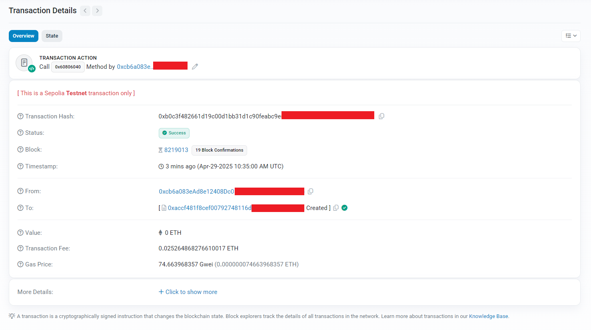

# Hardhat + TypeScript Starter

## Setup

```bash
npm install
cp .env.example .env     # fill secrets
```

## Core commands

| action         | command                                               |
| -------------- | ----------------------------------------------------- |
| compile        | `npm run compile`                                     |
| test           | `npm run test`                                        |
| local deploy   | `npm run deploy`                                      |
| Sepolia deploy | `npx hardhat run scripts/deploy.ts --network sepolia` |
| verify on scan | `npx hardhat verify --network sepolia <addr> "msg"`   |

## Lint / format

```bash
npm run lint && npm run format
```
## Final result
Transaction confirmed and contract created successfully on Sepolia Testnet


